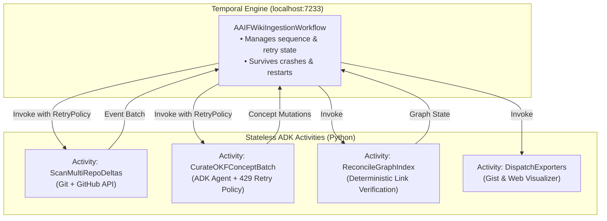

# ADR-002: Durability & Orchestration with Temporal + Google ADK

## Status
**Accepted**

## Context
Multi-repository documentation ingestion involves multiple heterogeneous operations:
- Git cloning, pulling, and commit log parsing across 15 repositories.
- GitHub API calls for open and merged pull requests.
- LLM inference calls for delta synthesis and concept curation.
- Markdown file parsing, AST link resolution, and Gist publishing.

If any stage fails (due to a GitHub secondary rate-limit, LLM 429 quota exhaustion, network socket reset, or local machine shutdown), standard scripting approaches either:
1. Crash, leaving the local Git state and knowledge bundle corrupted.
2. Require restarting from scratch, wasting tokens and hitting subsequent rate limits.
3. Employ crude `try/except: time.sleep()` loops that block threads and lack transaction guarantees.

## Decision
We decouple orchestration from agent logic using **Temporal** as the durability layer and **Google ADK** as the agent execution framework.

### Architecture Breakdown
1. **Temporal Workflows (`aaif_wiki/workflows/`)**:
   - `AAIFWikiIngestionWorkflow`: Coordinates the end-to-end ingestion lifecycle.
   - Defines granular checkpoints and passes immutable data contracts between activities.
   - Enforces exponential retry policies with jitter across all external network/LLM boundaries.
2. **ADK Agent Activities**:
   - Each activity wraps a focused Google ADK agent or deterministic tool.
   - Activities remain **stateless**: they accept typed Pydantic payloads, execute within an iteration budget, and return structured mutation receipts.
3. **Execution Modes**:
   - **Local Dev Server**: Runs against a lightweight local Temporal server (`temporal server start-dev` or Docker).
   - **Standalone CLI Fallback**: A local direct runner (`aaif-wiki run --direct`) allows executing the activity sequence directly for fast local unit testing without a running Temporal daemon.

## Consequences

### Positive
* **Zero Lost Work**: If an LLM call fails at repository #14 with a 429, Temporal automatically pauses, executes an exponential backoff, and resumes at repo #14 without repeating repos #1–13.
* **Full Observability**: Every activity execution, retry attempt, duration, and error trace is recorded in Temporal’s Web UI (`http://localhost:8233`).
* **Clean Separation of Concerns**: Agent code focuses strictly on prompt reasoning and Markdown parsing; workflow code handles retries, queues, and concurrency.

### Negative / Trade-offs
* **Prerequisite Service**: Requires running the local Temporal dev server binary or container for production runs.
