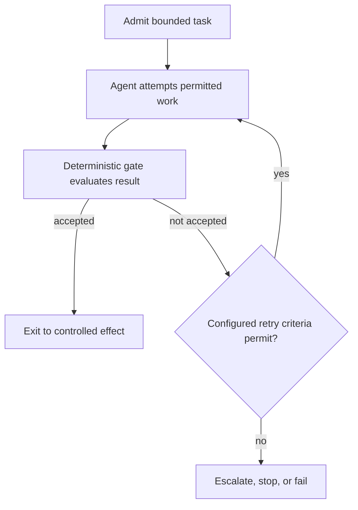

# Overview

The Bounded Convergence Loop is an orchestration pattern for multi-attempt agent tasks—such as dependency remediation, type fixing, or documentation corrections—that ensures iterations operate within strict computational budgets and terminate safely [^evt-wg-workflows-and-process-integration-file-dc0b08806fbd-19da1bf0]. Rather than granting an agent open-ended execution autonomy or letting it decide when a task is finished, the loop evaluates each candidate attempt against an external [Deterministic Acceptance Gate](deterministic-acceptance-gate.md) [^evt-wg-workflows-and-process-integration-file-dc0b08806fbd-19da1bf0].

# Architecture / Specification

The pattern integrates a workflow engine, a bounded agent/tool execution environment, a deterministic gate, a state store, and an audit logger [^evt-wg-workflows-and-process-integration-file-dc0b08806fbd-19da1bf0].

### Invariants

- **Explicit Scope and Acceptance:** The problem scope, tool permissions, and completion criteria are locked before the loop starts [^evt-wg-workflows-and-process-integration-file-dc0b08806fbd-19da1bf0].
- **No Model Self-Convergence:** The agent cannot declare its own success; only the deterministic gate can confirm convergence [^evt-wg-workflows-and-process-integration-file-dc0b08806fbd-19da1bf0].
- **Mandatory Budgets:** Every loop execution requires an iteration limit and at least one cost or time ceiling [^evt-wg-workflows-and-process-integration-file-dc0b08806fbd-19da1bf0].
- **Recorded State & Resumption:** Attempt counters, gate outcomes, and terminal escalation reasons are recorded; workflow restarts resume from persisted state without resetting consumed budgets [^evt-wg-workflows-and-process-integration-file-dc0b08806fbd-19da1bf0].
- **Controlled Downstream Effect:** Upon gate acceptance, the resulting effect is executed through a separate controlled executor rather than direct agent privileges [^evt-wg-workflows-and-process-integration-file-dc0b08806fbd-19da1bf0].

# Lifecycle History

Established within the [Workflows & Process Integration Working Group](../working-groups/workflows-and-process-integration.md) reference architecture workstream as a foundational pattern for bounded autonomous operations [^evt-wg-workflows-and-process-integration-pr-26].

[^evt-wg-workflows-and-process-integration-file-dc0b08806fbd-19da1bf0]: https://github.com/aaif/wg-workflows-and-process-integration/blob/3b4d645499620b10b313297e7f365148fa6d0ee1/workstreams/reference-architectures/patterns/bounded-convergence-loop.md
[^evt-wg-workflows-and-process-integration-pr-26]: https://github.com/aaif/wg-workflows-and-process-integration/pull/26
