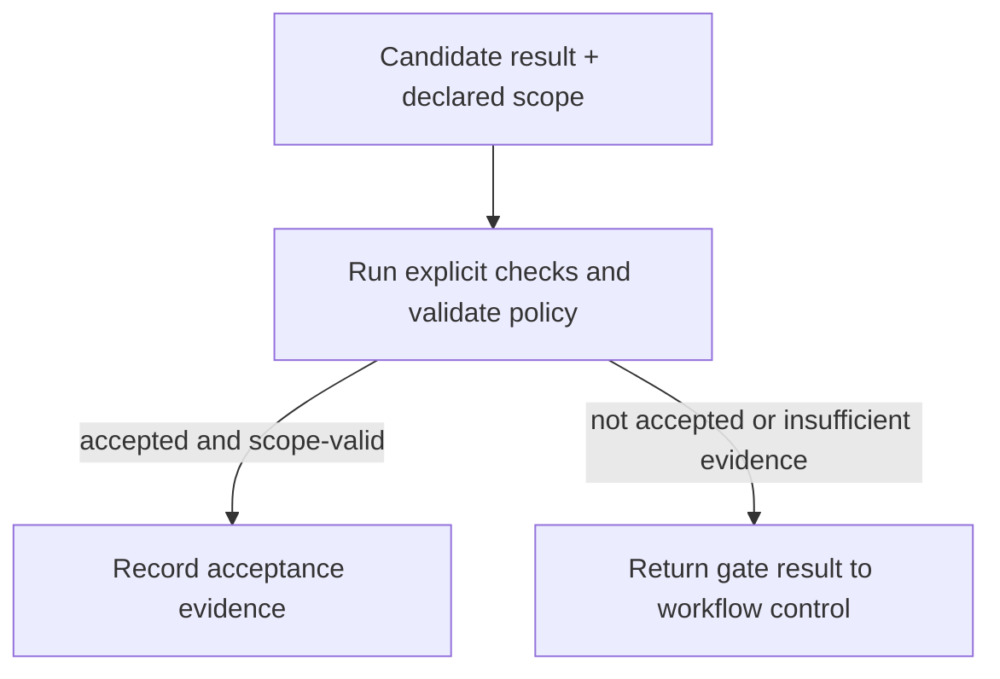

# Overview

The Deterministic Acceptance Gate is an architectural pattern that decides whether an agent-generated candidate result is permitted to advance by applying explicit, repeatable criteria rather than relying on model self-assessment [^evt-wg-workflows-and-process-integration-file-970f1ea4eefc-f3be8658]. In agentic workflows, self-evaluation by the generating model is vulnerable to confident hallucination and unwarranted self-certification; this pattern enforces external verification via test suites, contracts, schema validations, and policy constraints [^evt-wg-workflows-and-process-integration-file-970f1ea4eefc-f3be8658].

# Architecture / Specification

The pattern requires three core capabilities: a deterministic evaluator, a policy/scope validator, and an evidence store [^evt-wg-workflows-and-process-integration-file-970f1ea4eefc-f3be8658].

### Key Invariants

- **Pre-declared Criteria:** Acceptance criteria and allowable scopes are established before candidate evaluation begins [^evt-wg-workflows-and-process-integration-file-970f1ea4eefc-f3be8658].
- **Independence:** The evaluator operates strictly independently of the model or agent that produced the candidate [^evt-wg-workflows-and-process-integration-file-970f1ea4eefc-f3be8658].
- **Cryptographic/Digest Binding:** Verification evidence is permanently bound to the specific version or digest of the candidate artifact [^evt-wg-workflows-and-process-integration-file-970f1ea4eefc-f3be8658].
- **Dual Validation:** A result must pass both deterministic technical checks and scope/policy validation; passing tests alone is insufficient if the change exceeds allowed boundaries [^evt-wg-workflows-and-process-integration-file-970f1ea4eefc-f3be8658].
- **Fail-Closed:** Missing, failed, or ambiguous validation results default to non-acceptance [^evt-wg-workflows-and-process-integration-file-970f1ea4eefc-f3be8658].

# Lifecycle History

Introduced by the [Workflows & Process Integration Working Group](../working-groups/workflows-and-process-integration.md) as part of the bounded autonomous remediation reference architecture [^evt-wg-workflows-and-process-integration-pr-26] alongside [Bounded Convergence Loop](bounded-convergence-loop.md) and [Proposal/Execution Split](proposal-execution-split.md).

[^evt-wg-workflows-and-process-integration-file-970f1ea4eefc-f3be8658]: https://github.com/aaif/wg-workflows-and-process-integration/blob/3b4d645499620b10b313297e7f365148fa6d0ee1/workstreams/reference-architectures/patterns/deterministic-acceptance-gate.md
[^evt-wg-workflows-and-process-integration-pr-26]: https://github.com/aaif/wg-workflows-and-process-integration/pull/26
